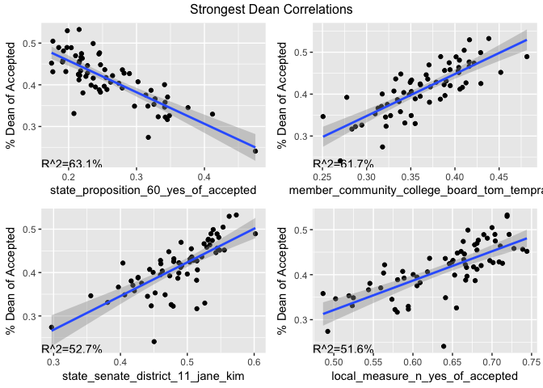
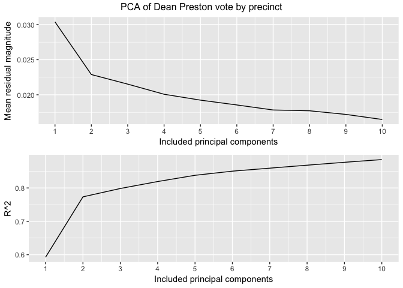

Analysis of the November 2016 San Francisco Election Results
================
Charles Davis

Introduction
============

As a San Francisco resident, data scientist, and highly political person, I've endeavored to conduct some analysis of the city's recent election results. Most Americans were shocked in some way by the November 2016 elections; essentially nobody thought Donald Trump would be president, and there were plenty of fairly surprising result to be found in California and San Francisco. As one of a number of possible examples, the fact that the death penalty was not just maintained but expedited was certainly a surprise to me and to everyone I knew; I don't know that I ever saw any actual polling on this issue, but I had certainly assumed, given the ostensibly liberal character of California, that it would be repealed in a landslide.

Understanding the roots of these upsets must be paramount for any political project, electoral or otherwise. In the course of this analysis, I hope to tease out some less obvious conclusions about these results; certainly some neighborhoods have different political character than others, but approaching this with an eye to nuance beyond the left/right binary will make it far easier to pinpoint exactly what happened. I hope to use this data to infer as much as possible about the different kinds of San Francisco voters, both out of a deep, visceral curiosity and in the hopes of perhaps eventually using these conslusions to more effectively engage folks in direct and electoral political action.

I definitely have a deep "academic" interest in this material; that being said, I volunteered extensively with Dean Preston's campaign for supervisor of District 5, which naturally partly informs my motivation to look into this data. Self-fulfillment notwithstanding, my work with the campaign has given me a uniquely intimate view into the District 5 supervisor race, so I'll focus much of my analysis on it not only because it is the race in which I'm most interested, but because it is the race in which I have the most non-data expertise.

Data
----

The data to be analyzed in this project is precinct-level voting data from the San Francisco November 2016 election.

### Sources

See the [readme](./README.md) for the sources of the data. All original data is contained in the [source data](./data/source_data/) directory of this respository.

### Pre-Processing

The .csv files used to conduct this analysis are processed from the [source data](./data/source_data/) into the [actual files used](./data/derived_data/) as part of this [IPython notebook](./geodatabase_from_source_data.ipynb).

Feature creation
----------------

Now on to feature creation and cleaning. We don't care about over vote (votes where too many choices were filled in, and so were disregarded,) on its own, so we'll certainly drop that. We'll drop under votes as well; at least as far as I understand it, under votes are still counted towards the candidates that were filled in, but the number of ballots that didn't fill out the maximum number of candidates isn't very meaningful to us on its own. For the ballot measures, we'll normalize the yes votes as yes/(yes+no), which we'll call "yes\_of\_accepted", and drop the no votes. For races with people, we'll drop write-in since I'd be shocked if that had any useful information, and then normalize the rest of the votes as votes\_for\_candidate/ballots\_cast. For every measure we'll also create a feature calculated as ballots\_cast/registration, called which we'll call "turnout."

As far as dropping over votes, we should still check what percentage of the votes were over votes just to sleep more soundly; this number turns out to be 0.111% of the ballots cast for a measure were over votes, so we don't need to worry too much about their interpretation.

Understanding the District 5 Supervisor Race
============================================

A race near and dear to me. There were two candidates for supervisor of District 5 this past November: London Breed, the incumbent and president of the board of supervisors, and Dean Preston. For those not steeped in San Francisco politics, a fairly uncontroversial heuristic would be to compare this to the Hillary/Bernie race, with London/Dean playing those respective roles. There's certainly more nuance to it, and the Overton window of San Francisco is a good deal to the left of that of the country, but the moderate/progressive, establishment/avowedly non-corporate comparison holds up fairly well. The endorsements bear this out: the Democratic party endorsed London, while the post-Bernie group Our Revolution and the San Francisco Berniecrats endorsed Dean.

As I mentioned in the intro, I volunteered pretty extensively with Dean's campaign, and was pretty bummed that he lost. At some level, all of this analysis is moot because more outreach could have decided the day - about 6,000 people voted but left supervisor blank, and London's margin of victory was about 2,000 votes. Nonetheless, it's definitely still worth understanding the breakdown of people who did vote. Given the above statistic, it's probably worth eventually coming back to figure out which areas in particular filled out ballots but left supervisor blank, and why they did so. We'll leave this til later, though, and focus on understanding people who did vote.

Let's start by just checking out what the Dean vote percent correlates with:

|      | Second.Variable                                    |  Correlation|
|------|:---------------------------------------------------|------------:|
| 1309 | board\_of\_supervisors\_district\_5\_london\_breed |   -0.8381209|
| 3286 | state\_proposition\_60\_yes\_of\_accepted          |   -0.7942342|
| 2298 | member\_community\_college\_board\_tom\_temprano   |    0.7854591|
| 1307 | state\_senate\_district\_11\_jane\_kim             |    0.7261804|
| 4882 | local\_measure\_n\_yes\_of\_accepted               |    0.7185520|
| 5186 | local\_measure\_r\_yes\_of\_accepted               |   -0.7116213|
| 1462 | superior\_court\_judge\_seat\_7\_paul\_henderson   |   -0.7107428|
| 3590 | state\_proposition\_64\_yes\_of\_accepted          |    0.7061534|
| 1614 | member\_board\_of\_education\_mark\_sanchez        |    0.7020750|
| 1386 | superior\_court\_judge\_seat\_7\_victor\_hwang     |    0.7001912|
| 2830 | state\_proposition\_54\_yes\_of\_accepted          |    0.6991095|
| 5034 | local\_measure\_p\_yes\_of\_accepted               |   -0.6879823|
| 4958 | local\_measure\_o\_yes\_of\_accepted               |   -0.6838210|
| 1690 | member\_board\_of\_education\_stevon\_cook         |    0.6774235|
| 5110 | local\_measure\_q\_yes\_of\_accepted               |   -0.6748343|

Nothing too surprising or counterintuitive in the top couple - London correlating against Dean so strongly obviously makes sense, and, as I've noted elsewhere, a precinct's choice of supervisor is most strongly correlated with whether or not it wanted mandatory condom use in porn (State Prop 60), hilariously enough. Let's look at plots of the top 4 (excluding London):

Breaking it down: PCA
---------------------

Doing a series of linear regressions against other ballot measures doesn't get us very far in understanding the factors underlying the results of the District 5 supervisor race. The State Prop 60 (mandatory condom use in porn) result correlating so strongly with the Dean vote is hilarious and weird, but not super surprising - there's probably something like a latent age variable underlying it. Tom Temprano essentially ran with Dean, basically every voter guide that endorsed Dean also endorsed Jane Kim, and, while I wouldn't have guessed Prop N (non-citizen voting in school board elections) would be number 4, neither is it suprising when viewed from the traditional left/right political paradigm.

We want to essentially understand the latent variables underlying the election results. The way to get to latent variables, in a formal sense, would be something like factor analysis or partial least squares regression. However, we're going to use principal components analysis. Why? I'm more familiar with it, and it almost always gives a very similar result to factor analysis. Perhaps more importantly, though, principal components are by definition orthogonal, whereas latent variables are not necessarily orthogonal. I'll explain why I think that's a desirable property for this interpretation after we examine the principal components.

Our approach here will essentially be a home-cooked version of principal components regression:

-   Do dimensionality reduction using PCA
-   Find the principal components that correlate most strongly with some measure in which we are interested (first, the percent of Dean vote in the district 5 supervisor race)
-   Check how much of the variance in our response variable (Dean) the PCs explain when used in a multiple linear regression, and choose how many to keep for the sake of parsimony
-   Test whether those same principal components also explain a good chunk of the variance in other measures where there's a clear progressive/moderate split

As mentioned above, we'll first try this on the D5 supervisor race because I'm personally attached to it and I wanna know what happened, damnit!

|     | First.Variable                                     | Second.Variable |  Correlation|
|-----|:---------------------------------------------------|:----------------|------------:|
| 507 | board\_of\_supervisors\_district\_5\_dean\_preston | PC1             |   -0.7698738|
| 509 | board\_of\_supervisors\_district\_5\_dean\_preston | PC3             |    0.4250636|
| 526 | board\_of\_supervisors\_district\_5\_dean\_preston | PC20            |   -0.1582237|
| 527 | board\_of\_supervisors\_district\_5\_dean\_preston | PC21            |   -0.1442558|
| 516 | board\_of\_supervisors\_district\_5\_dean\_preston | PC10            |    0.1367424|
| 513 | board\_of\_supervisors\_district\_5\_dean\_preston | PC7             |   -0.1114788|
| 520 | board\_of\_supervisors\_district\_5\_dean\_preston | PC14            |    0.0946193|
| 523 | board\_of\_supervisors\_district\_5\_dean\_preston | PC17            |    0.0943992|
| 518 | board\_of\_supervisors\_district\_5\_dean\_preston | PC12            |    0.0931777|
| 528 | board\_of\_supervisors\_district\_5\_dean\_preston | PC22            |    0.0900820|

Now let's just try a multiple linear regression on the top couple:

    ## Analysis of Variance Table
    ## 
    ## Model  1: board_of_supervisors_district_5_dean_preston ~ PC1
    ## Model  2: board_of_supervisors_district_5_dean_preston ~ PC1 + PC3
    ## Model  3: board_of_supervisors_district_5_dean_preston ~ PC1 + PC3 + PC20
    ## Model  4: board_of_supervisors_district_5_dean_preston ~ PC1 + PC3 + PC20 + 
    ##     PC21
    ## Model  5: board_of_supervisors_district_5_dean_preston ~ PC1 + PC3 + PC20 + 
    ##     PC21 + PC10
    ## Model  6: board_of_supervisors_district_5_dean_preston ~ PC1 + PC3 + PC20 + 
    ##     PC21 + PC10 + PC7
    ## Model  7: board_of_supervisors_district_5_dean_preston ~ PC1 + PC3 + PC20 + 
    ##     PC21 + PC10 + PC7 + PC14
    ## Model  8: board_of_supervisors_district_5_dean_preston ~ PC1 + PC3 + PC20 + 
    ##     PC21 + PC10 + PC7 + PC14 + PC17
    ## Model  9: board_of_supervisors_district_5_dean_preston ~ PC1 + PC3 + PC20 + 
    ##     PC21 + PC10 + PC7 + PC14 + PC17 + PC12
    ## Model 10: board_of_supervisors_district_5_dean_preston ~ PC1 + PC3 + PC20 + 
    ##     PC21 + PC10 + PC7 + PC14 + PC17 + PC12 + PC22
    ##    Res.Df      RSS Df Sum of Sq       F    Pr(>F)    
    ## 1      65 0.093988                                   
    ## 2      64 0.052294  1  0.041694 87.9952 4.403e-13 ***
    ## 3      63 0.046517  1  0.005777 12.1925 0.0009438 ***
    ## 4      62 0.041715  1  0.004802 10.1349 0.0023761 ** 
    ## 5      61 0.037400  1  0.004315  9.1066 0.0038279 ** 
    ## 6      60 0.034532  1  0.002868  6.0525 0.0169979 *  
    ## 7      59 0.032466  1  0.002066  4.3602 0.0413472 *  
    ## 8      58 0.030410  1  0.002056  4.3400 0.0418045 *  
    ## 9      57 0.028407  1  0.002003  4.2284 0.0444247 *  
    ## 10     56 0.026534  1  0.001873  3.9521 0.0517104 .  
    ## ---
    ## Signif. codes:  0 '***' 0.001 '**' 0.01 '*' 0.05 '.' 0.1 ' ' 1

So even for something simple like multiple linear regression we don't need to include more than 9 PCs. Let's plot how adding more PCs affects the accuracy of our model:

In the interest of parsimony, let's restrict ourselves to the 3 most explanatory principle components, which in total explain 79.8% of the variation in Dean's percent vote by precinct. Let's go through them one by one; I'll attempt to explain what I think they represent using my qualitative knowledge of local politics/the polarization around a given measure:

### PC1 : General "Conservativeness"

| measure.name                                     |  rotation.coefficient|
|:-------------------------------------------------|---------------------:|
| local\_measure\_n\_yes\_of\_accepted             |            -0.1590757|
| local\_measure\_q\_yes\_of\_accepted             |             0.1574998|
| member\_board\_of\_education\_stevon\_cook       |            -0.1551521|
| local\_measure\_k\_yes\_of\_accepted             |            -0.1506544|
| local\_measure\_g\_yes\_of\_accepted             |            -0.1503145|
| state\_proposition\_62\_yes\_of\_accepted        |            -0.1502726|
| state\_proposition\_66\_yes\_of\_accepted        |             0.1495159|
| state\_proposition\_64\_yes\_of\_accepted        |            -0.1466200|
| local\_measure\_r\_yes\_of\_accepted             |             0.1451694|
| local\_measure\_p\_yes\_of\_accepted             |             0.1447655|
| state\_proposition\_57\_yes\_of\_accepted        |            -0.1447630|
| school\_measure\_b\_yes\_of\_accepted            |            -0.1431361|
| local\_measure\_w\_yes\_of\_accepted             |            -0.1428451|
| state\_senate\_district\_11\_jane\_kim           |            -0.1419237|
| member\_community\_college\_board\_tom\_temprano |            -0.1404996|

PC1 corresponds to something like **general "conservativness"** - things like keeping the death penalty, not raising taxes, maintaining the criminalization of marijuana, voting for the nefarious Prop Q which was essentially a symbolic middle finger to homeless people, and, depressingly, emphatically not voting for the one black candidate for the board of education. This one's a no-brainer, and it holds fairly well for all of the most important features in this PC.

### PC3: Anti-Corporate/Anti-Establishment Sentiment

| measure.name                                                  |  rotation.coefficient|
|:--------------------------------------------------------------|---------------------:|
| us\_representative\_district\_12\_preston\_picus              |             0.3519357|
| us\_representative\_district\_12\_nancy\_pelosi               |            -0.3196312|
| state\_proposition\_51\_yes\_of\_accepted                     |            -0.3077057|
| member\_community\_college\_board\_alex\_randolph             |            -0.2262744|
| member\_board\_of\_education\_rachel\_norton                  |            -0.2095583|
| president\_and\_vice\_president\_gary\_johnson\_\_bill\_weld  |             0.1965036|
| local\_measure\_t\_yes\_of\_accepted                          |             0.1806424|
| member\_board\_of\_education\_ian\_kalin                      |             0.1798670|
| member\_board\_of\_education\_jill\_wynns                     |            -0.1681090|
| school\_measure\_a\_yes\_of\_accepted                         |            -0.1661394|
| state\_proposition\_54\_yes\_of\_accepted                     |             0.1655670|
| state\_proposition\_60\_yes\_of\_accepted                     |            -0.1578418|
| president\_and\_vice\_president\_jill\_stein\_\_ajamu\_baraka |             0.1550697|
| member\_community\_college\_board\_amy\_bacharach             |            -0.1540507|
| state\_proposition\_52\_yes\_of\_accepted                     |            -0.1536686|

PC5 is a little harder to interpet, as there are some conflicting components here as far as cleavage along traditional left/right political lines. At first one might think this is the progressive democrat contingent, since voting for Preston Picus and not for Nancy Pelosi were the single most important features of this PC, but the ballot measures (and positive coefficient for Gary Johnson) complicate that interpretation. I suspect this principal component represents something more like **anti-establishment sentiment**. From the perspective of candidates, we see that this PC voted for Dean Preston, Preston Picus, Jill Stein, and Gary Johnson, and emphatically NOT for London Breed, Nancy Pelosi, or Hillary Clinton, which can pretty uncontroversially be classified as an insurgent/establishment binary. However, from the point of view of ballot measures, this PC also voted against school bonds and condoms in porn; and for restrictions on campaign contributions from lobbyists and transparency in the state legislature. I believe this feature can then be interpreted as distrust of the establishment, both political and corporate, and especially the intersection of the two. These may be small-government folks, some libertarians (as we see from the Gary Johnson coefficient,) or just people whose defining political ideology is less a left/right persepctive than it is an antagonistic stance towards what they may view as a corrupt political establishment.

*Note that the school board/community college members here were a little all over the place since you could vote for about half of the field, so I didn't belabor them, but they roughly match the above interpretation.*

### PC20: Poorer, older folks

| measure.name                                                             |  rotation.coefficient|
|:-------------------------------------------------------------------------|---------------------:|
| state\_proposition\_54\_yes\_of\_accepted                                |             0.3645306|
| member\_board\_of\_education\_rob\_geller                                |             0.3222220|
| us\_representative\_district\_12\_preston\_picus                         |            -0.2467094|
| local\_measure\_e\_yes\_of\_accepted                                     |            -0.2449115|
| local\_measure\_u\_yes\_of\_accepted                                     |            -0.2344685|
| local\_measure\_c\_yes\_of\_accepted                                     |             0.2164574|
| president\_and\_vice\_president\_writein\_bernard\_bernie\_sanders\_\_tu |            -0.2109391|
| local\_measure\_q\_yes\_of\_accepted                                     |            -0.1905958|
| state\_proposition\_56\_yes\_of\_accepted                                |             0.1904713|
| member\_board\_of\_education\_ian\_kalin                                 |             0.1745506|
| member\_board\_of\_education\_phil\_kim                                  |             0.1717663|
| state\_proposition\_52\_yes\_of\_accepted                                |             0.1575712|
| us\_representative\_district\_12\_nancy\_pelosi                          |             0.1462571|
| district\_measure\_rr\_yes\_of\_accepted                                 |            -0.1453031|
| local\_measure\_p\_yes\_of\_accepted                                     |            -0.1436568|

This one also isn't nearly as easy to interpret as PC1, but I suspect this is something like **older, poorer, more socially moderate folks**. Coupled with the fact that this feature correlates the third most strongly with whether or not a precinct voted for Dean (and correlates negatively,) I suspect this may also be capturing some information about race. Without being too on the nose, given the makeup of District 5 and knowing a bit about which neighborhoods voted which way, it wouldn't be unreasonable to guess that this corresponds to something like older black folks. This PC voted for things like condoms in porn and transparency in government, and against the anti-homelessness prop Q, but the defining characteristic of this PC was that it voted strongly for affordable housing at every opportunity. It also voted for Nancy Pelosi and London Breed over Preston Picus and Dean Preston, which leads me to believe that this is older, socially moderate folks.

A few things in this are hard to interpret, most notably the rejection of the tree ordinance and the BART bond. I can't explain the latter at all really, and I recall there being some very neighborhood-specific antipathy towards the tree ordinance, but I wouldn't feel comfortable hazarding an interpretation of it. The school board folks are a little weird here too, but Rob Geller in particular got such a small percent of the vote that it could just be a few anomalous precincts - this is only a population of 67 precincts, after all.

### Why Orthogonality is Good

I mentioned earlier that I actually think orthogonality is a desirable property for the features we're creating/interpreting. PLSR and FA create features that can usually explain the same amount of variance as PCA with slightly fewer features, which is certainly an advantage, but orthogonality means that we can interpet the principal components *totally independently of each other*; e.g., varying PC3 would tell us how much more likely someone is to vote for Dean based on their anti-authoritarian impulses *while holding conservatism and status as elderly poor constant*. If these vectors weren't orthogonal, that wouldn't (necessarily) be the case. Practically, this means that we couldn't, e.g., measure a precinct's anti-authoritarian impulse as distinct from its conservatism; these two are probably somehow related, and unless the vectors we create to represent them are orthogonal, we can't separate them out completely.
